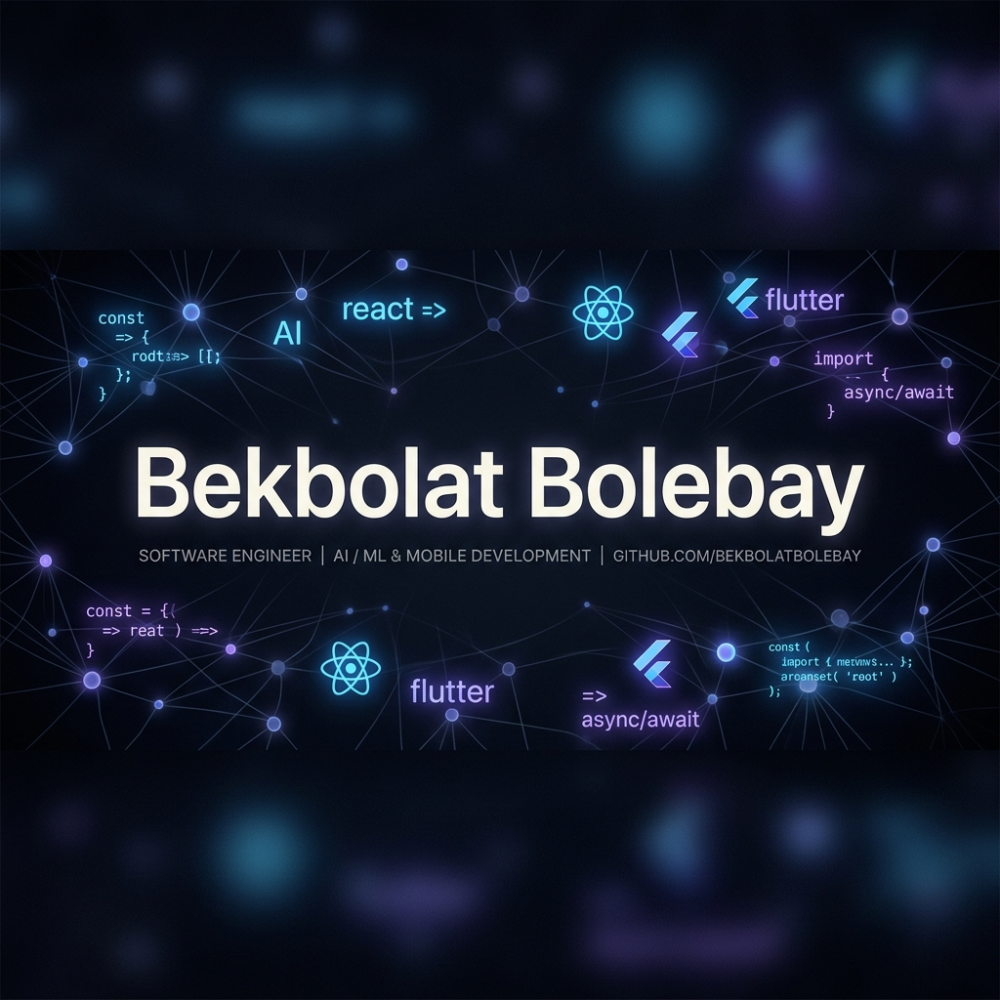

  
  
   
  
  <h1>👋 Сәлем! Мен Бекболатпын</h1>
  <h3>🚀 Modern Web & Mobile App Developer | AI & Machine Learning Enthusiast</h3>
  
  

    
    
    
  

---

### 📖 Өзім туралы

Мен заманауи веб және мобильді қосымшаларды әзірлеумен айналысамын. Жасанды интеллект (AI) және Machine Learning (ML) салаларына деген қызығушылығым жоғары. Әрқашан жаңа технологияларды үйренуге және күрделі мәселелерді шешуге дайынмын.

---

### 🛠 Технологиялық стек

  

- **Frontend:** React, Next.js, TSX
- **Mobile:** Flutter (Dart)
- **Backend & DevOps:** Docker, Git
- **AI/ML:** Python, Data Analysis, Neural Networks

---

### 📊 Менің статистикаларым

  

  

  

---

### 💬 Байланыс

Егер сізде сұрақтар болса немесе бірлесіп жұмыс істегіңіз келсе, маған жазудан тартынбаңыз!

- 📱 **Telegram:** [@bolebaybekbolat](https://t.me/bolebaybekbolat)
- 📸 **Instagram:** [@your_instagram](https://instagram.com/your_instagram)
- 📧 **Email:** bekbolat@example.com (мысал ретінде)

   
  

